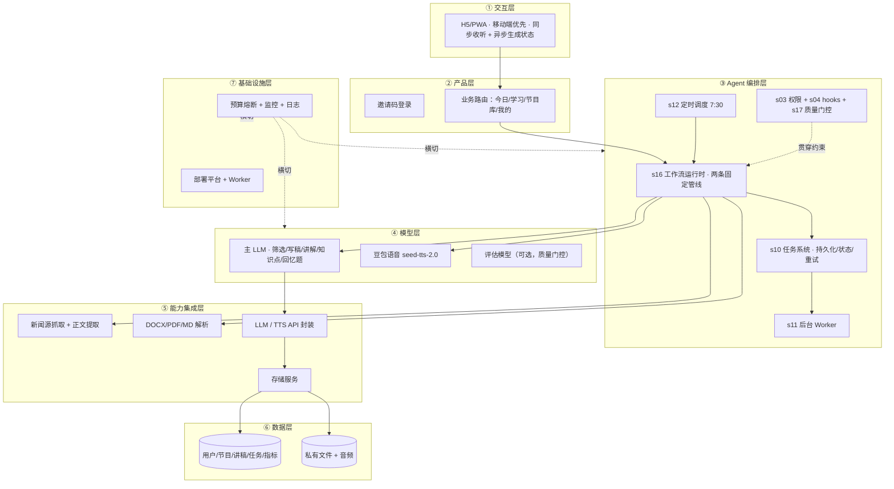

# AI 学习电台 · 架构推导方案

> 输入：PRD《AI 学习电台：MVP 需求总结》
> 方法：按 `BLUEPRINT.md` 第二节「五步 SOP」推导
> 状态：**方案**（LLM、TTS 与第一阶段音色策略已确认；第一阶段可在 mock 条件下开工）

---

## 〇、一个决定全局的关键判断

这份 PRD 的「智能」集中在**内容生成**（新闻筛选去重、写稿、教学化讲解、知识点/回忆题提取），但**编排形态是固定的**——新闻管线（抓取 → 提取 → 去重 → 筛选 → 写稿 → 语音）和学习管线（解析 → 讲稿 → 知识点 → 回忆题 → 语音），每次的步骤和先后关系都一样。

因此它**不是一个开放式对话 Agent**（让模型自由探索工具），而是蓝图里最典型的 **s16 工作流运行时**场景：

> **脚本决定编排，模型决定单步。**

这是后面所有选型的根。

---

## 第一步：需求拆解 —— 提取硬事实

| 维度 | 拆解结果 |
|---|---|
| **目标** | 3 周内完成开发、上线、早期运营，作为作品集。两条核心链路：每日新闻→中文节目；学习资料→教学化播客。可量化成功标准：≥5 位真实测试用户、≥3 位次日回访、生成成功率 ≥90%、用户能追溯原文来源、用户认可学习播客有用 |
| **用户** | 发起人 + 学习班同学。移动端优先 H5/PWA。交互**同步为主**（收听），但**生成是异步**（长任务不可同步等待）。人机比：约 5+ 真人 + 1 管理员 |
| **核心闭环** | ① 输入邀请码→选频道→听今日节目→查来源→次日复访；② 输入邀请码→上传资料/贴链接→生成私人播客→听讲解→看知识点→完成主动回忆 |
| **交付物** | 中文单主播音频（新闻 5–8 分钟 / 学习 5–10 分钟）。学习侧额外：完整文字稿、5 个知识点、3 道主动回忆题（答案折叠）、来源；新闻侧：摘要、标题、原文链接 |
| **边界** | 不补造新闻（不足就缩短）；不支持 .doc / 扫描 PDF / 图片音视频 / 复杂公式 / 需登录网页；不支持多文件、开放问答、双主播、社交；私人节目不支持分享；每天每人 2 期私人额度；用户数据严格隔离 |
| **约束** | 每天 7:30 前发布新闻；单文件 ≤15MB、正文 ≤3 万字；月成本与相册合计 ≤1000 元（→ 同频道共享一份新闻节目）；邀请码只存哈希；原始文件解析后删除；API 密钥只在服务端；需限流 + 预算熔断 |

### 危险信号检查（来自方法论）

- ✅ 有可度量成功标准（PRD 第 7 节）
- ✅ 边界清晰，有明确的「不包含」清单
- ✅ 外部系统不多（新闻源、LLM、TTS、存储四类）
- ⚠️ 「僵化工作流」信号：管线确实固定，但**内容节点需要模型判断**，所以不是「不需要 Agent」，而是正好落在 s16 的适用区

### 已确认与待确认（不脑补）

1. ✅ **LLM**：火山方舟 `doubao-seed-2-1-pro-260628`，关闭深度思考，使用 JSON Schema。
2. ✅ **TTS**：火山豆包语音 `seed-tts-2.0`。私人节目可选 3 个白名单音色；新闻固定使用“儒雅青年 2.0”。
3. **可信新闻源清单**（三个频道各自哪几个源）——PRD 只说「预先配置」。
4. **部署平台**——未指定。
5. **邀请码如何发放**（管理员后台生成？手动脚本？）——PRD 只提「管理员可加额度」。
6. ✅ **3 万字处理策略**：按标题/段落切成约 6000–8000 字的分块，先生成忠实要点，再合成最终讲稿。
7. 共享节目对登录用户可见性等后续交互细节。

---

## 第二步：领域建模 —— 映射到 Harness 五要素

> `Harness = 工具 + 知识 + 观察 + 行动接口 + 权限`

| 五要素 | 内容 |
|---|---|
| **工具** | 新闻抓取、网页正文提取、DOCX/PDF/MD 解析、LLM（筛选/写稿/讲解/知识点/回忆题）、TTS、存储读写、邀请码验证、额度管理、限流 |
| **知识** | 频道定义（AI 前沿 / 科技产品 / 创业商业）、可信来源清单、节目规范（单主播 · 5–8 分钟 · 中文）、教学讲解固定结构（学习目标→背景概念→分点解释→示例类比→总结复盘→回忆题）、新闻筛选标准（有价值 · 不重复 · 可追溯）、私人节目音色白名单、新闻固定品牌音色、隐私规则 |
| **观察** | 生成任务状态（进行中/成功/失败 + 原因）、重试与错误日志、播放指标（开始/50%/完成）、邀请码验证、频道选择、生成成功率、成本与预算、原文可追溯性 |
| **行动** | REST API（LLM/TTS/存储/新闻源）、后台 Worker、定时调度（7:30） |
| **权限** | 用户级数据隔离（RLS）、邀请码哈希、API 密钥服务端、管理员加额度、原始文件即删、一键删除、每日额度、限流、预算熔断、第三方处理告知 |

**产出**：这张五要素清单就是产品的「领域骨架」。

---

## 第三步：组件选型 —— 只选需要的

| 选/不选 | 组件 | 理由 |
|---|---|---|
| ✅ 必选 | **s02 工具系统** | 外部动作多（LLM/TTS/解析/抓取/存储），封装成统一工具池 |
| ✅ 必选 | **s03 权限系统** | 用户隔离、额度、限流、预算熔断、删除操作 |
| ✅ 必选 | **s04 钩子系统** | 埋点、限流拦截、错误记录，挂在管线节点上 |
| ✅ 必选 | **s10 任务系统** | 生成任务持久化、状态机、失败重试、断点续跑 |
| ✅ 必选 | **s11 后台任务** | 生成是慢操作，必须异步，不阻塞 |
| ✅ 必选 | **s12 定时调度** | 每天 7:30 触发新闻管线 |
| ✅ **核心** | **s16 工作流运行时** | 两条管线编排固定，脚本写编排 + journal 续跑 |
| ⭕ 可选 | **s17 目标闭环** | 质量门控（「是否可追溯 / 是否编造 / 时长是否达标」）——建议作为独立判断器，MVP 可先简化为规则校验 |
| ❌ 不选 | s05 todo_write | 无开放式多步自由规划，编排固定 |
| ❌ 不选 | s06 子 agent | 无上下文爆问题；成本敏感，不并行派子任务 |
| ❌ 不选 | s07 技能加载 | 知识规模小，固定提示词即可，无需技能目录系统 |
| ❌ 不选 | s08 上下文压缩 | 批处理任务，无长会话 |
| ❌ 不选 | s09 记忆系统 | 用户偏好/历史是普通用户数据，进数据库，不需要 Agent 记忆 |
| ❌ 不选 | s13 agent 团队 | 单人产品；3 频道并行用简单队列即可 |
| ❌ 不选 | s14 MCP | 外部系统固定，直接写工具；MCP 属过度设计 |

> **选型自检**：「没有 s15 完整集成 harness 会怎样？」——不会失败。这个产品的 harness 是**后端服务 + 固定管线**，不是 25 工具的自由 agent loop。s15 只作为方法论参考，不照搬。

---

## 第四步：架构设计

### 4.1 分层架构图（7 层 + 数据流 + 落地锚点）



**贯穿数据流（新闻管线）**：
`cron 7:30 → 工作流启动 → 抓取 3 频道可信来源(24h) → 正文提取 → 每条经 LLM 筛选去重(≤6 条) → LLM 写单主播稿 → 固定“儒雅青年 2.0”合成 → 落库发布为共享节目 → 用户进入「今日」页收听 → 播放事件回写指标`

**贯穿数据流（学习管线）**：
`用户上传文件/贴链接 + 选择白名单音色 → 建任务(异步) → 解析提取正文(≤3万字) → [分块] LLM 生成讲稿(固定结构) → 提取 5 知识点 + 3 回忆题 → seed-tts-2.0 按所选音色合成 → 写私有库 → 任务完成通知 → 用户收听/看知识点/做回忆题`

### 4.2 工具清单（归属编排层，供工作流节点调用）

| # | 工具 | 输入 | 输出 | 副作用 | 权限 |
|---|---|---|---|---|---|
| 1 | `fetch_news_sources` | channel | 原始条目(标题/链接/正文) | 网络请求（只读） | 服务端内部 |
| 2 | `extract_article_text` | url | 纯文本 | 网络请求（只读） | 服务端内部 |
| 3 | `select_news` (LLM) | 提取后条目 | ≤6 条{标题/摘要/来源/理由} | LLM 调用（成本） | 服务端内部 |
| 4 | `write_news_script` (LLM) | 选中新闻 | 5–8min 中文稿 | LLM 调用 | 服务端内部 |
| 5 | `parse_document` | 文件(≤15MB) | 提取文本(≤3万字) | 解析 + 原始文件删除 | 用户私有 |
| 6 | `generate_lesson` (LLM) | 文本 + 用户重点 | 固定结构讲稿 | LLM 调用 | 用户私有 |
| 7 | `extract_knowledge_points` (LLM) | 讲稿 | 5 知识点 | LLM 调用 | 用户私有 |
| 8 | `generate_recall_questions` (LLM) | 讲稿 | 3 题(答案折叠) | LLM 调用 | 用户私有 |
| 9 | `synthesize_speech` | 讲稿 + 受控 `voice_key` | 音频 URL + 时长 | `seed-tts-2.0` 调用（成本）+ 私有存储 | 服务端内部；音色必须来自白名单 |
| 10 | `publish_program` | 音频+条目 | 节目记录 | 写 DB/存储 | 服务端内部 |
| 11 | `verify_invite_code` | 邀请码 | 用户身份 | 哈希比对（只读）+ 埋点 | 匿名 |
| 12 | `check/consume_quota` | user | 额度结果 | 读/写额度 | 用户 |
| 13 | `delete_all_user_data` | user | 删除结果 | 销毁私有数据 | 用户（二次确认） |
| 14 | `admin_add_quota` | user, n | 结果 | 写额度 | 仅管理员 |
| 15 | `quality_gate` (s17 可选) | 节目产物 | {ok, reason, impossible} | 评估模型调用 | 服务端内部 |

### 4.3 系统提示词草案

**① 新闻筛选（select_news）**
```
你是新闻编辑。从以下过去 24 小时抓取自可信来源的条目中，为「{频道}」挑选
最多 5~6 条有价值且不重复的新闻。
规则：只使用提供的条目，禁止编造任何事实；关键事实必须可追溯到原始来源；
条目不足时宁缺毋滥，直接缩短节目。
输出 JSON：[{title, summary, source_url, why_selected}]
```

**② 新闻写稿（write_news_script）**
```
你是中文单主播播客主播。根据筛选出的新闻写一份 5~8 分钟（约 1200~2000 字）
的节目稿。要求：口语化、客观中立、每条新闻标明来源；不添加原文没有的事实。
结构：开场 → 逐条播报 → 收尾。
```

**③ 教学讲解（generate_lesson）**
```
你是中文教师。把用户的学习资料转换成 5~10 分钟的单人教学播客讲稿。
固定结构：学习目标 → 背景与概念 → 分点解释 → 示例或类比 → 总结复盘 → 主动回忆问题。
规则：明确区分「原资料内容」与「AI 补充说明」；不得编造资料中没有的事实；
另输出 5 个核心知识点和 3 道主动回忆问题（答案默认折叠）。
用户特别想理解：{focus}
```

**④ 质量门控（quality_gate，s17 可选）**
```
你是内容审查员。判断生成的节目是否：1) 事实可追溯到原始来源；2) 无编造；
3) 符合时长与结构要求；4) 正确区分原文与 AI 补充。
只根据对话中已有的产物判断，不重跑任何工具。输出 {ok, reason, impossible}。
```

### 4.4 上下文与记忆策略

- **会话内**：每条生成是**一次性批处理**，无长会话。单次 LLM 调用的输入 = 提取文本（≤3 万字）+ 固定提示词。⚠️ **3 万字 token 预算**是主要技术风险：建议**分块生成讲稿再拼接**（每块约 6000–8000 字，块间传上下文小结），或选长上下文模型——**待确认**。
- **跨会话**：用户频道偏好、额度、节目历史、生成结果全部走**数据库**，不引入 s09 记忆系统（它们是被动数据，不是「模型主动提取的可复用知识」）。

### 4.5 权限与安全边界 + 降级策略

| 风险 | 措施 | 降级 |
|---|---|---|
| 用户数据泄露 | RLS 用户级隔离；私有存储非公开链接；邀请码仅存哈希 | 删除权限被拒时明确报错 |
| 成本失控 | 月预算熔断 + 每人每日 2 期额度 + 同频道共享新闻音频 | 熔断时返回友好提示，不静默失败 |
| 网页/文件解析失败 | 明确失败原因 + 允许用户更换输入 | 单源失败跳过该源；全部失败则任务标记失败 |
| LLM/TTS 失败 | 自动重试（指数退避） | 重试仍失败→任务失败并通知；TTS 失败可降级为「仅文字稿」 |
| 新闻失真/重复 | 固定可信来源 + 先去重再写稿 + 保留原文链接 + 不补造 | 不足就缩短节目 |
| 长任务超时 | 异步任务状态 + 重试，不用同步请求 | 前端轮询任务状态 |

### 4.6 可观测性设计

- **日志**：结构化日志（任务 ID、管线节点、耗时、错误栈）。
- **指标**：邀请码验证、频道选择、播放开始/50%/完成、生成成功率、每期成本、生成耗时。
- **轨迹数据**（未来微调原料）：LLM 输入输出、筛选决策、重试记录——存 JSONL，MVP 可选但建议从第一天就采。

### 4.7 技术栈与部署形态

- **前端**：移动端优先 H5/PWA（可加主屏、锁屏播放）
- **后端**：Python + FastAPI API + 独立 Worker 进程（跑 s16 工作流运行时 + s10 任务系统 + s11 后台任务）
- **调度**：cron，每日 7:30
- **数据/存储/音频**：PostgreSQL + 对象存储（或 MVP 阶段 SQLite + 本地文件，用户量小够用）
- **队列**：MVP 用 DB 任务表 + Worker 轮询（避免引入重型 MQ，符合 3 周周期）
- **LLM / TTS**：火山方舟 `doubao-seed-2-1-pro-260628` + 豆包语音 `seed-tts-2.0`
- **部署**：单机服务（Worker 与 API 同机）→ 后续可拆分（**平台待确认**）

---

## 第五步：代码生成计划（确认后才执行）

按铁律，**方案未确认前不写产品代码**。确认后按三层递进：

1. **骨架**：可运行的工作流运行时 + 两条管线（新闻/学习）+ 3~5 个领域工具 + 上述系统提示词
2. **硬化**：任务状态机、重试/超时、额度与熔断、RLS 权限、结构化日志、失败降级
3. **产品化**：接入真实 LLM/TTS/存储、埋点、部署脚本、README、测试

---

## 验收标准对照（Demo vs 生产）

| 维度 | Demo | 生产（目标） |
|---|---|---|
| 运行 | 手动步骤 | 一条命令 |
| 错误 | 忽略 | 降级路径 |
| 可观测 | print() | 日志 + 指标 + 轨迹 |
| 配置 | 硬编码 | 外置 |
| 测试 | 无 | 单测 + 边界测试 |
| 部署 | 「我机器上能跑」 | 有文档的部署形态 |
| 成功 | 「看起来对」 | 可度量的指标 |

一个产物只有满足右列全部，才算可落地。

---

## 决策状态

1. ✅ LLM：火山方舟 `doubao-seed-2-1-pro-260628`。
2. ✅ TTS：豆包语音 `seed-tts-2.0`。
3. ✅ 私人节目音色：儒雅青年 2.0、知性灿灿 2.0、渊博小叔 2.0；新闻固定儒雅青年 2.0。
4. ✅ 3 万字正文：按标题/段落切为约 6000–8000 字的分块。
5. ⏳ 可信新闻源清单：建议每频道先配置 2–3 个公开可信源。
6. ⏳ 部署平台：进入上线阶段前确认。
7. ⏳ 邀请码发放方式：第一阶段建议管理员脚本生成、手动发放。
8. ⏳ 本项目月度测试预算：建议 500 元，与 AI 相册合计不超过 1000 元。
