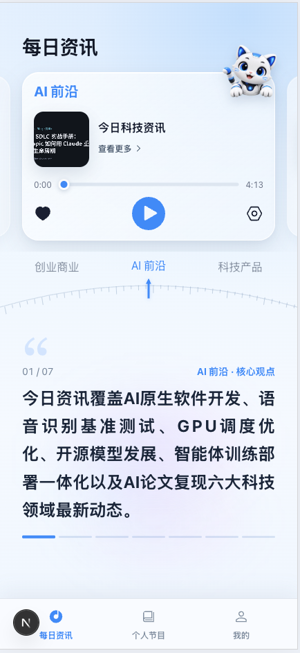
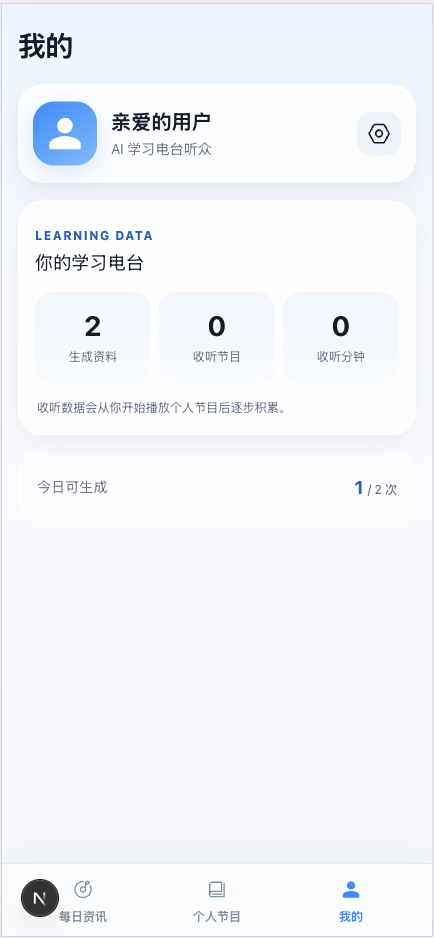

# AI 学习电台

把资讯和学习资料变成可收听、可复习的中文 AI 节目。

[](https://github.com/liyongyan129-maker/ai-learning-radio/actions/workflows/ci.yml)
[](LICENSE)


AI 学习电台把零散资讯和个人文档整理成中文讲解、音频、知识点与回忆问题，让“收藏过”更容易走到“听过、理解过、复习过”。节目保留来源和逐字稿，方便随时回到原文核对。

## 产品预览

<table>
  <thead>
    <tr>
      <th align="center">每日资讯</th>
      <th align="center">个人节目</th>
      <th align="center">我的</th>
    </tr>
  </thead>
  <tbody>
    <tr>
      <td align="center"></td>
      <td align="center"></td>
      <td align="center"></td>
    </tr>
  </tbody>
</table>

## 项目解决什么问题

资讯流太快、长文太重、收藏夹又太安静。这个项目希望缩短内容与学习之间的距离：

- 从每日来源中整理值得听的内容，同时保留文章链接，减少脱离来源的摘要消费。
- 把 PDF、DOCX 和 Markdown 学习资料转换成更适合通勤或碎片时间的中文节目。
- 不止生成音频，还沉淀逐字稿、知识点和主动回忆问题，形成一个轻量复习闭环。

## 三条核心体验

### 1. 每日资讯

聚合 RSS 与网页来源，按频道筛选、去重并生成中文音频节目。用户可以边听边查看节目逐字稿和原始文章来源。

### 2. 个人节目

上传自己的 PDF、DOCX 或 Markdown 资料，通过持久化任务生成教学化讲解与音频。长任务交给独立 Worker，前端可以持续查看生成进度。

### 3. 学习回顾

节目不仅可播放，也会组织知识点与主动回忆问题。用户可以从节目详情回看讲解、检查理解并再次收听。

## 适合谁

- 想把通勤、散步等时间用于听资讯和复习的学习者。
- 希望研究“内容提取 → 结构化生成 → TTS → 主动回忆”完整链路的 AI 产品开发者。
- 需要一个带 mock Provider、成本熔断和可恢复任务流的 FastAPI + Next.js 示例项目的工程师。

## 架构

```text
Next.js 16 Web（3001）
        │ HTTP / Cookie
        ▼
FastAPI API（8002） ── SQLAlchemy / Alembic ── SQLite
        │                                          │
        └── 持久化生成任务 ◄── Worker ── LLM / TTS Provider
                                          └── 本地私有文件存储
```

产品对外保留一个 `LearningRadioAgent` 能力入口；抓取、来源绑定、预算、持久化和文件访问由确定性代码控制。耗时生成步骤写入数据库，由独立 Worker 领取并执行，前端轮询任务状态。

- 后端：Python 3.11、FastAPI、Pydantic、SQLAlchemy、Alembic、pytest、Ruff。
- 前端：Node.js 24、Next.js 16、React 19、TypeScript、Tailwind CSS、ESLint。
- 本地基础设施：SQLite、本地私有文件目录、独立轮询 Worker。

## 快速开始

需要 Python 3.11、[uv](https://docs.astral.sh/uv/)、Node.js 24 和 npm。

```bash
git clone https://github.com/liyongyan129-maker/ai-learning-radio.git
cd ai-learning-radio
./setup.sh
```

`setup.sh` 是幂等安装脚本：它检查工具版本，在配置不存在时复制安全示例，按锁文件安装依赖并执行数据库迁移。脚本不会启动服务，也不会调用真实 Provider。

首次使用时创建邀请码：

```bash
cd backend
uv run python -m scripts.create_invite --name "本地用户"
```

然后在三个终端分别运行：

```bash
# 终端 1：API
cd backend
uv run uvicorn app.main:app --host 127.0.0.1 --port 8002

# 终端 2：后台任务 Worker
cd backend
uv run python -m app.worker.main

# 终端 3：Web
cd frontend
npm run dev
```

打开 <http://127.0.0.1:3001>。API 文档位于 <http://127.0.0.1:8002/docs>。

<details>
<summary>手动安装</summary>

```bash
cp .env.example .env
cp frontend/.env.example frontend/.env.local

cd backend
uv sync --locked
uv run alembic upgrade head

cd ../frontend
npm ci
```

已有 `.env` 或 `frontend/.env.local` 时不要覆盖。后端会依次读取根目录和 `backend/` 下的 `.env`；Next.js 只从 `frontend/` 读取前端环境文件。

</details>

## mock 与真实 Provider

项目默认处于安全的 mock 模式：

```dotenv
LLM_PROVIDER=mock
TTS_PROVIDER=mock
PROVIDER_CALLS_ENABLED=false
PROJECT_MONTHLY_BUDGET_CNY=0
```

mock 模式用于开发界面、任务流和数据模型，不产生外部模型费用。Worker 会自动补齐 mock 新闻节目；也可以手动运行：

```bash
cd backend
uv run python -m scripts.seed_news_sources
uv run python -m scripts.generate_news
```

启用真实 Provider 前，请在本地 `.env` 中配置火山方舟 LLM 与豆包 TTS 凭证，校准模型、音色和计费单价，并显式打开调用与预算：

```dotenv
LLM_PROVIDER=volcark
TTS_PROVIDER=volc
PROVIDER_CALLS_ENABLED=true
PROJECT_MONTHLY_BUDGET_CNY=100
```

真实调用会向第三方服务发送待处理文本，并可能产生费用。不要上传敏感、受版权限制或无权处理的资料。应用内预算是熔断措施，不等同于供应商账单上限；还应在供应商控制台设置额度和告警。

## 安全、隐私与部署边界

- `.env`、数据库、上传资料、生成音频和私有存储不应提交 Git；建议在发布流程中使用 Secret Scanner。
- 非开发环境会拒绝默认 `APP_SECRET`/`INVITE_CODE_PEPPER`、不安全 Cookie 和非 HTTPS 前端来源。
- 生产凭证应放入部署平台的 Secret 管理服务，不能写入镜像或仓库。
- SQLite 和本地文件存储适合个人开发或受控试用。公开部署前应评估托管数据库、对象存储、备份、队列、观测、限流和数据删除机制。
- AI 生成内容可能遗漏或出错；新闻与学习节目应回看原始来源，不能替代专业意见。

安全漏洞请按 [SECURITY.md](SECURITY.md) 私下报告，不要在公开 Issue 中披露。

## 测试与质量检查

```bash
# 后端
cd backend
uv run ruff check .
uv run pytest

# 前端
cd frontend
npm test
npm run lint
npm run build
```

GitHub Actions 会在 pull request 和 `main` 分支推送时分别运行后端与前端检查。

## 贡献

欢迎提交问题、文档改进和范围清晰的功能变更。开始前请阅读 [CONTRIBUTING.md](CONTRIBUTING.md) 和 [CODE_OF_CONDUCT.md](CODE_OF_CONDUCT.md)。项目采用轻量 GitHub Flow，并推荐 Conventional Commits。

## 许可证

代码与项目原创素材由 AI Learning Radio contributors 依据 [Apache License 2.0](LICENSE) 授权。第三方产品、模型和平台名称归各自权利人所有；素材边界见 [ASSETS.md](ASSETS.md)。
